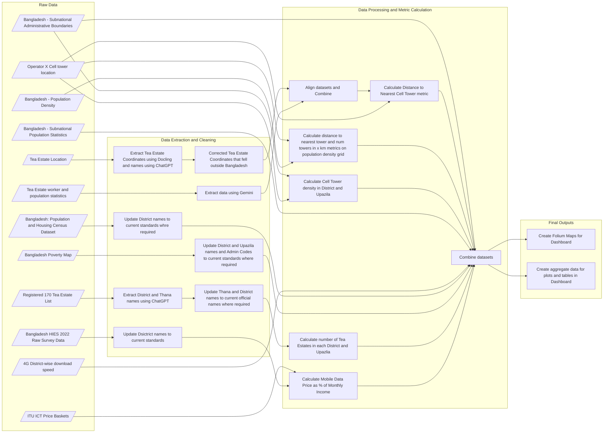

# Seeping Lights ITU data hackathon project 2026

In this project we analyze the current state of Universal and Meaningful Connectivity (UMC) in Bangladesh with a special focus on Tea Estates workers and population. The final deliverable of the analysis is a dashboard that helps visualize the key variables related to achieving UMC in Bangladesh.


## Datasets Used

Both public and private (proprietary) datasets were used in the analysis. The following table gives overview of the datasets used:


| Dataset name | Source (organization/provider) | Link (URL) | Coverage (geographic detail and time) | Key variables (max. 5) | Format (CSV, JSON, XLS, SQL, etc.) | Access method (download, API call, scraping, etc.) | Filename(s) used in Project |
|---|---|---|---|---|---|---|---|
| 4G District-wise download speed | BTRC | [Proprietary](https://drive.google.com/file/d/1cyEG846h9zFgtyZInvY35Lu_BaS9YJ6n/view?usp=drive_link) | Bangladesh, up to District (Admin 02) level, 2026 | 4G Avg. UE throughput DL (MB) | XLSX | Download | [data/raw/qos_radio_network_kpi_2026-05-19.xlsx](https://drive.google.com/file/d/1cyEG846h9zFgtyZInvY35Lu_BaS9YJ6n/view?usp=drive_link) |
| Tea Estate Location | Bangladesh Tea Board | [Proprietary](https://drive.google.com/file/d/1nsYx7tp3dM28QtBxyEaatEnnQFvQAycC/view?usp=drive_link) | Sylhet, 2026 | lat, lon | PDF | Download | [data/raw/tea.pdf](https://drive.google.com/file/d/1nsYx7tp3dM28QtBxyEaatEnnQFvQAycC/view?usp=drive_link) |
| Tea Estate worker and population statistics | Tea Board Sylhet | [Proprietary](https://drive.google.com/file/d/1pOrtwU_HY7on5I4aNPxFzMYL7DT3A8xr/view?usp=drive_link) | Sylhet, 2026 | unreg_workes, tea_estate_pop | PDF | Download | [data/raw/tea_workers.pdf](https://drive.google.com/file/d/1pOrtwU_HY7on5I4aNPxFzMYL7DT3A8xr/view?usp=drive_link), [data/raw/tea_workers.csv](https://drive.google.com/file/d/1ulcEZ1CHYYkaNF5iGrIAw3FB7vuHffnM/view?usp=drive_link) |
| Operator X Cell tower location | Operator X Employee | [Proprietary](https://drive.google.com/file/d/16WMRQwqFU-8WHdrESuJ0u1fVxjQC7ajB/view?usp=drive_link) | Bangladesh, 2026 | lat, lon | XLSX | Download | [data/raw/tower.xlsx](https://drive.google.com/file/d/16WMRQwqFU-8WHdrESuJ0u1fVxjQC7ajB/view?usp=drive_link) |
| Registered 170 Tea Estate List | Bangladesh Tea Board | https://teaboard.gov.bd/pages/notices/6922ed22dbfab28ce0c016c | Bangladesh, 2025 | District, Thana | PDF | Download | [data/raw/Tea_Estates_list.pdf](https://drive.google.com/file/d/1FzvjSSeshkqmHuW31ZDRQQnhCf2Ch3N8/view?usp=drive_link), [data/raw/tea_estates_extracted.csv](https://drive.google.com/file/d/1byMYZLrhZQ-T37l1bVPShGKqh9pxxEE3/view?usp=drive_link) |
| ITU ICT Price Baskets | International Telecommunication Union (ITU) | https://www.itu.int/en/ITU-D/Statistics/Pages/ICTprices/default.aspx | World, Countrywise, 2008-2025 | Unit, Code, Economy | XLSX | Download | [data/raw/ITU_ICTPriceBaskets_2008-2025.xlsx](https://drive.google.com/file/d/1MnWdJwcX04SkkCmHQSX2zmL_lZg-60Qp/view?usp=drive_link) |
| Bangladesh: Population and Housing Census Dataset | Bangladesh Bureau of Statistics (BBS) | https://data.humdata.org/dataset/population-and-housing-census-dataset | Bangladesh, up to District (Admin 02) level, 2022 | %_Mobile Phone_Total_15 year+, %_Internet_Total_15 year+ | XLSX | Download | [data/raw/bangladesh_bbs_population-and-housing-census-dataset_2022_admin-02.xlsx](https://drive.google.com/file/d/1TKsWnI7X2-jC3Wyk2yR8oUPCYS8nEgvK/view?usp=drive_link) |
| Bangladesh HIES 2022 Raw Survey Data | Bangladesh Bureau of Statistics (BBS) | [Proprietary](https://drive.google.com/file/d/1Y4o5gGJxZcVRRzBUFbnk3GVSxroAUWpm/view?usp=sharing) | Bangladesh, up to District (Admin 02) level, 2022 | s4bq16 (code for Monthly_income) | DTA (Stata Data File) | Download | [data/raw/HH_SEC_4A.dta](https://drive.google.com/file/d/1Y4o5gGJxZcVRRzBUFbnk3GVSxroAUWpm/view?usp=drive_link) |
| Bangladesh - Subnational Administrative Boundaries | Office for the Coordination of Humanitarian Affairs (OCHA) | https://ckan.rimes.int/dataset/bangladesh-subnational-boundaries | Bangladesh, up to Admin level 04, 2024 | Geometry, AREA_SQKM | GDB, XLSX | Download | [data/raw/BGD_AdminBoundaries_candidate.gdb](https://drive.google.com/drive/folders/13zW37yoGnWLxGYZFKnODaFSNvhhu_6rN?usp=drive_link), [data/raw/ data/raw/bgd_adminboundaries_tabulardata.xlsx](https://drive.google.com/file/d/1gcREYocxm3tXA4fg3B-ZY5Hx2TZVNfiL/view?usp=drive_link) |
| Bangladesh - Population Density | WorldPop | https://data.humdata.org/dataset/worldpop-population-density-for-bangladesh | Bangladesh, resolution of 30 arc-seconds, 2020 | lat, lon, population_density | CSV | Download | [data/raw/bgd_pd_2020_1km_UNadj_ASCII_XYZ.csv](https://drive.google.com/file/d/1nvpcEjeyI86JMifJxalU1tDtQpVaIGIr/view?usp=drive_link) |
| Bangladesh - Subnational Population Statistics | UNFPA | https://data.humdata.org/dataset/cod-ps-bgd | Bangladesh upto administrative level 0-3, 2022 | T_TL | XLSX | Download | [data/raw/bgd_admpop_2022.xlsx](https://drive.google.com/file/d/1Y2pTWQjg74rOhCyhOQP0L3kHL8ISgDJB/view?usp=drive_link) |
| Bangladesh Poverty Map | World Bank Group | https://www.worldbank.org/en/data/interactive/2016/11/10/bangladesh-poverty-maps | Bangladesh, upto administrative level 2-3, 2010 | Poverty headcount ratio (%) 4G | XLSX, GDB | Download | [data/raw/gis_data/gdb/Bangladesh_Data.gdb](https://drive.google.com/drive/folders/18DWlmJezigRtjq7sV_0kniGzIC76pWZR?usp=drive_link), [data/raw/zila_and_upazila_data/upazila_indicators.xlsx](https://drive.google.com/file/d/1xU-t7UFqAxpBn7Gpby5YQjaWqeZCKqz6/view?usp=drive_link), [data/raw/zila_and_upazila_data/zila_indicators.xlsx](https://drive.google.com/file/d/18zL98o7oMxKMUOWIEhM4f24w-J5jYCAg/view?usp=drive_link) |


## Data Pipeline Overview




## Data Cleaning

The following cleaning procedures were performed:

- Standardized district and upazila names across datasets.
- Updated historical district names in the 2010 poverty dataset.
- Corrected tea estate coordinates that fell outside Bangladesh.
- Verified tea estate locations using Google Maps.
- Harmonized administrative codes across census, poverty, and boundary datasets.
- Converted all spatial data to a common coordinate reference system.


## Methodology:

The goal of the analysis is a dashboard that visualizes the following:

1. Spatial distribution of key demographic variables and network connectivity metrics.
2. Correlation among demographic variables and connectivity metrics.
3. Deeper look into current connectivity of tea estates.

For visualization of spatial information we used administrative boundaries obtained from [Bangladesh - Subnational Administrative Boundaries](https://ckan.rimes.int/dataset/bangladesh-subnational-boundaries) which provided boundaries upto Admin 04 (Union) level. The population for each administrative region was obtained from [Bangladesh - Subnational Population Statistics](https://data.humdata.org/dataset/cod-ps-bgd) dataset. Demographic information are obtained from [Bangladesh Population & Housing Census 2022](https://data.humdata.org/dataset/populationa-and-housing-census-dataset). The report only contained data upto Admin 02 (District) level and we used the variables: % of population using internet, % population having mobile phone, literacy rate (7+), employment rate, % population having financial account, % population having mobile bank account. For all these variables we have overall numbers and broken down by gender. We also obtained the % of population with electricity from this dataset. These three datasets had slight variations in some district names as these were made a few years apart. This was joined by [2010 Poverty Map](https://www.worldbank.org/en/data/interactive/2016/11/10/bangladesh-poverty-maps) from which we get district level and upazila level poverty headcount ratio and extreme poverty headcount ratio. These were used as proxy for income distribution at District and Upazila level. Since the poverty dataset is from 2010 which is much earlier than 2022, some of the district names and admin codes had to be updated in order to merge it with the other datasets.

We also got [Bangladesh HIES 2022 Raw Survey Data](https://drive.google.com/file/d/1Y4o5gGJxZcVRRzBUFbnk3GVSxroAUWpm/view?usp=sharing) from proprietary sources which had income data for each District. Although it had data for all districts, for many districts the sample size was too small to be representative, hence in final dashboard this data was viewed along with the sample count for each district. We joined this with [ITU ICT Price Baskets](https://www.itu.int/en/ITU-D/Statistics/Pages/ICTprices/default.aspx) data to calculate the price of 5GB moblie data as percentage of monthly income.

For network connectivity metrics we used  [proprietary cell tower locations](https://drive.google.com/file/d/16WMRQwqFU-8WHdrESuJ0u1fVxjQC7ajB/view?usp=drive_link) from 2026 of an anonymous mobile operator. We used this to calculate the number of towers and cell tower density in each administrative region. We combined the cell tower location data with [gridded population density](https://data.humdata.org/dataset/worldpop-population-density-for-bangladesh) data from 2020 to find the distance to nearest tower from each grid point and calculated summary statistics of this distance within each administrative region weighted by the population density. The datasets were converted to projected coordinate system EPSG:3106 (Gulshan 303 / TM 90 NE) for distance calculation and then converted back to geographic coordinate system EPSG:4326 (WGS84, World Geodetic System 1984) for visualization. We also obtained another proprietary [district-level dataset on average 4G Download Speed (Mbps)](https://drive.google.com/file/d/1cyEG846h9zFgtyZInvY35Lu_BaS9YJ6n/view?usp=drive_link) in 2026 from BTRC.

We obtained the Admin 02 (district) and Admin 03 (thana/upazila) of each [tea estate in Bangladesh](https://teaboard.gov.bd/pages/notices/6922ed22dbfbab28ce0c016c) in 2025, and used ChatGPT to extract the [data in csv format](https://drive.google.com/file/d/1byMYZLrhZQ-T37l1bVPShGKqh9pxxEE3/view?usp=sharing). The data was cleaned to make the district and upazila names to match with the official datasets. This data was then used to find number of Tea Estates in each Admin 02 (district) and Admin 03 (upazila). For deeper look into tea estates we obtained [coordinates of tea estates in Sylhet](https://drive.google.com/file/d/1nsYx7tp3dM28QtBxyEaatEnnQFvQAycC/view?usp=drive_link) as well as the [number of workers and population at each Sylhet tea estate](https://drive.google.com/file/d/1pOrtwU_HY7on5I4aNPxFzMYL7DT3A8xr/view?usp=drive_link) both in 2026 from proprietary sources. We extracted tables with data from the [coordinates of tea estates in Sylhet](https://drive.google.com/file/d/1nsYx7tp3dM28QtBxyEaatEnnQFvQAycC/view?usp=drive_link) using Docling, but the tea garden names were extracted using ChatGPT and added separately. The data had some consistency errors in that some locations were outside of Bangladesh, even though, given the garden name, it should be within Bangladesh. These were cross-checked with Google Maps to find correct locations and fixed. We used Google Gemini to extract the data from pdf file of [number of workers and population at each Sylhet tea estate](https://drive.google.com/file/d/1pOrtwU_HY7on5I4aNPxFzMYL7DT3A8xr/view?usp=drive_link) into a [csv](https://drive.google.com/file/d/1ulcEZ1CHYYkaNF5iGrIAw3FB7vuHffnM/view?usp=drive_link). The tea estate locations and worker data are stored as [intermediate results](https://drive.google.com/file/d/1yd5VjHu2hgVaGcpM66aNJNm97_5N-Chh/view?usp=drive_link).

We used choropleth maps for visualizing the spatial distribution of variables. The demographic information obtained from census data was shown at only Admin 02 (District) level. The network connectivity metrics were visualized at Admin 02 (District) and Admin 03 (Upazila) level.

We also used choropleth maps in the deep dive into Sylhet tea estates, along with colored markers locating each tea estate. A table is also included listing each tea estate in Sylhet, highlighting the connectivity metrics that are lower than required.

We performed statistical test to check the slope coefficient among the variables in linear regression. We also displayed a scatter plot with a regression line to visualize the relation. The statistical test and visualization was done at Admin 02 (District) level data only, using both demographic variables and connectivity metrics. We also included a correlation heatmap to quickly identify important factors affecting connectivity.


## Project Structure

The structure of the project is given below:

```
.
├── data
│   ├── final
│   │   ├── district_data.csv
│   │   └── tea_data.csv
│   ├── intermediate
│   │   ├── final_thana_viz.gpkg
│   │   ├── final_viz.gpkg
│   │   └── ...
│   └── raw
│       ├── BGD_AdminBoundaries_candidate.gdb
│       ├── bgd_admpop_2022.xlsx
│       └── ...
├── outputs
│   ├── 4G_Avg._UE_throughput_DL_(MB).lzma
│   ├── Cell_tower_density.lzma
│   └── ...
├── pyproject.toml
├── constants.py
├── make_map_files.py
├── make_viz_file.py
├── dashboard.py
├── tea_lat_lon.py
├── requirements.txt
└── README.md
```

The datasets downloaded are placed in `data/raw/`. Python scripts are used to transform the raw data into intermediate datasets that are used in later stages, and final datasets that are used in the final streamlit dashboard. The intermediate datasets are stored in `/data/intermediate/`, and the final datasets are stored in `data/final/`. The intermediate datasets are used to generate html maps that are zipped and stored in `outputs/` directory.

The `pyproject.toml` file contains the dev dependencies, while the `requirements.txt` file has requirements for streamlit deployment.


## Usage

1. Preprocess tea estate datasets

The python script `tea_lat_lon.py` is used to read `data/raw/tea.pdf`, which has coordinates of tea estates in Sylhet, and the `data/raw/tea_workers.csv`, which has the population and number of workers in the Sylhet tea estates. The processed dataset is stored in `data/intermediate/tea_lat_lon.csv`.

```bash
python tea_lat_lon.py
```

2. Make intermediate and final datasets for visualization

The python script `make_viz_file.py` is used to read in the raw datasets and `data/intermediate/tea_lat_lon.csv` to make other intermediate datasets and some final datasets for visualization.

Intermediate datasets are:
- `data/intermediate/final_viz.gpkg`
- `data/intermediate/final_thana_viz.gpkg`
- `data/intermediate/tea_data.gpkg`

Final datasets are:
- `data/final/district_data.csv`
- `data/final/tea_data.csv`

```bash
python make_viz_file.py
```

3. Make map files

The choropleth maps are data intensive and take some time to generate, so they are not suitable to generate directly in the dashboard. Hence it is better to generate the choropleth maps and store them. This makes the process of displaying maps in dashboard significantly faster. The script `make_map_files.py` reads the intermediate datasets generated by `make_viz_file.py` and generates map files for each relevant variable. The maps are zipped and stored in `outputs/`.

```bash
python make_map_files.py
```

4. Display dashboard

The dashboard reads in maps from `outputs/` directory and datasets from `data/final/` and visualizes them to user.

```bash
streamlit run dashboard.py --server.port=8501 --server.address=0.0.0.0
```

This has been deployed to Streamlit Cloud and the dashboard can be found on [https://egmoeukl2amlsmpk6ydyqj.streamlit.app/](https://egmoeukl2amlsmpk6ydyqj.streamlit.app/)
